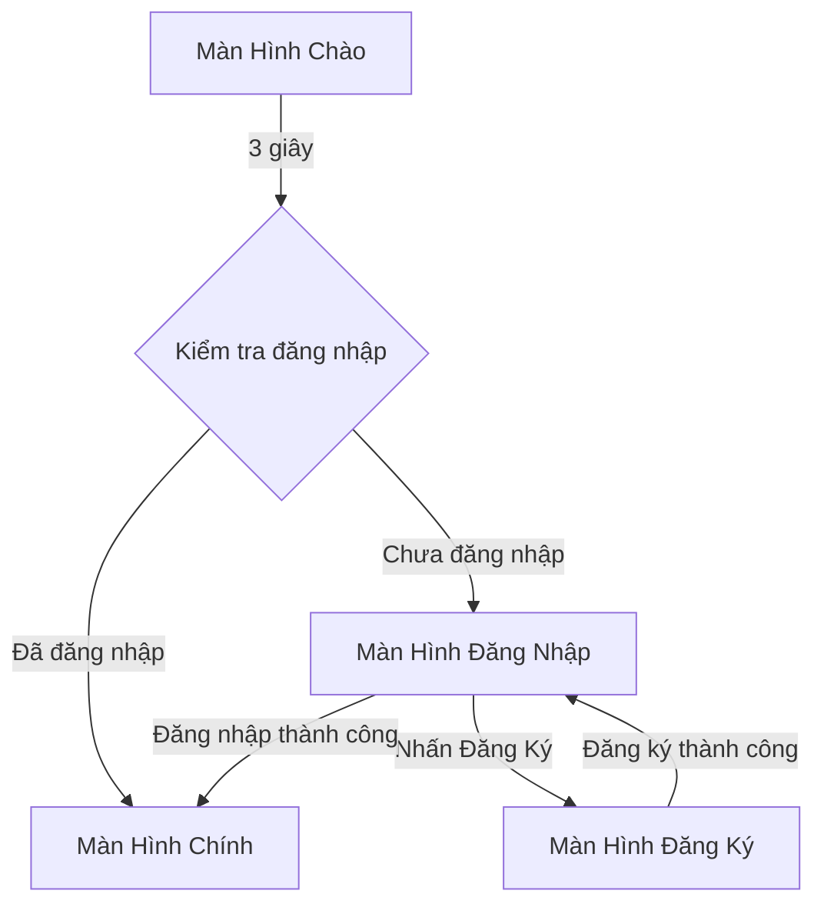

# Quy Trình Xác Thực và Màn Hình Chào trong Danaloca

## Tổng Quan

Hệ thống xác thực trong Danaloca bao gồm nhiều thành phần chính để xử lý đăng ký, đăng nhập và quản lý phiên người dùng. Ứng dụng sử dụng Firebase Authentication để xác thực người dùng và Firebase Realtime Database để lưu trữ dữ liệu người dùng.

## Sơ Đồ Luồng Xử Lý



## 1. Màn Hình Chào (MainActivity)

File: `MainActivity.kt`

### Chức năng chính:

- Hiển thị logo ứng dụng với hiệu ứng fade-in
- Hiển thị hiệu ứng loading bằng Lottie
- Khởi tạo Cloudinary để quản lý hình ảnh
- Kiểm tra trạng thái đăng nhập và điều hướng

### Quy trình:

1. Hiển thị màn hình chào trong 3 giây
2. Kiểm tra trạng thái đăng nhập:
   - Nếu đã đăng nhập -> Chuyển đến HomeActivity
   - Nếu chưa đăng nhập -> Chuyển đến LoginActivity

### Ví dụ mã:

```kotlin
Handler(Looper.getMainLooper()).postDelayed({
    val auth = FirebaseAuth.getInstance()
    if (auth.currentUser != null) {
        navigateToHome()
    } else {
        navigateToLogin()
    }
}, 3000)
```

## 2. Màn Hình Đăng Nhập (LoginActivity)

File: `LoginActivity.kt`

### Chức năng chính:

- Đăng nhập bằng email và mật khẩu
- Kiểm tra hợp lệ đầu vào
- Hiệu ứng chữ chào kiểu đánh máy
- Hiển thị trạng thái loading khi đăng nhập
- Điều hướng đến màn hình đăng ký

### Quy trình:

1. Kiểm tra đầu vào (định dạng email và mật khẩu)
2. Thực hiện đăng nhập với Firebase
3. Thành công -> Chuyển đến màn hình chính
4. Thất bại -> Hiển thị thông báo lỗi

### Hiệu ứng:

- Hiệu ứng đánh máy cho văn bản chào
- Hiệu ứng fade-in cho các trường nhập liệu

## 3. Màn Hình Đăng Ký (RegisterActivity)

File: `RegisterActivity.kt`

### Chức năng chính:

Thu thập thông tin người dùng:

- Email
- Mật khẩu
- Số điện thoại
- Họ tên
- Giới tính
- Địa điểm
- Ngày sinh
- Kiểm tra hợp lệ đầu vào
- Hiển thị tiến trình
- Điều hướng đến đăng nhập

### Mô hình dữ liệu người dùng:

```kotlin
data class User(
    val id: String = "",
    val username: String = "",
    val email: String = "",
    val fullName: String = "",
    val phoneNumber: String = "",
    val gender: String = "",
    val location: String = "",
    val birthdate: String = "",
    val age: String = "",
    val friends: Map<String, Boolean> = emptyMap(),
    val avatarUrl: String = ""
)
```

## 4. Quản Lý Dữ Liệu

### UserViewModel

File: `UserViewModel.kt`

Nhiệm vụ chính:

- Lưu dữ liệu người dùng vào Firebase
- Lấy thông tin người dùng
- Cập nhật ảnh đại diện
- Quản lý trạng thái loading và lỗi

### UserRepository

File: `UserRepository.kt`

Chức năng chính:

- Lưu dữ liệu người dùng
- Tìm kiếm người dùng theo ID, email hoặc số điện thoại
- Cập nhật thông tin người dùng
- Xóa dữ liệu người dùng
- Cập nhật ảnh đại diện

## Cách Chạy/Kiểm Tra

1. Khởi động ứng dụng
2. Màn hình chào xuất hiện với các hiệu ứng
3. Sau 3 giây:

   - Nếu đã đăng nhập: Chuyển đến màn hình chính
   - Nếu chưa đăng nhập: Hiển thị màn hình đăng nhập

4. Kiểm tra đăng nhập:

   - Nhập email và mật khẩu
   - Nhấn nút đăng nhập
   - Sẽ chuyển đến màn hình chính nếu thành công

5. Kiểm tra đăng ký:
   - Nhấn "Tạo tài khoản" trên màn hình đăng nhập
   - Điền đầy đủ thông tin yêu cầu
   - Nhấn nút đăng ký
   - Sẽ chuyển về màn hình đăng nhập nếu thành công

## Xử Lý Lỗi

- Định dạng email không hợp lệ
- Thiếu mật khẩu
- Sai thông tin đăng nhập
- Lỗi mạng
- Lỗi đăng ký (email đã tồn tại, mật khẩu yếu)
