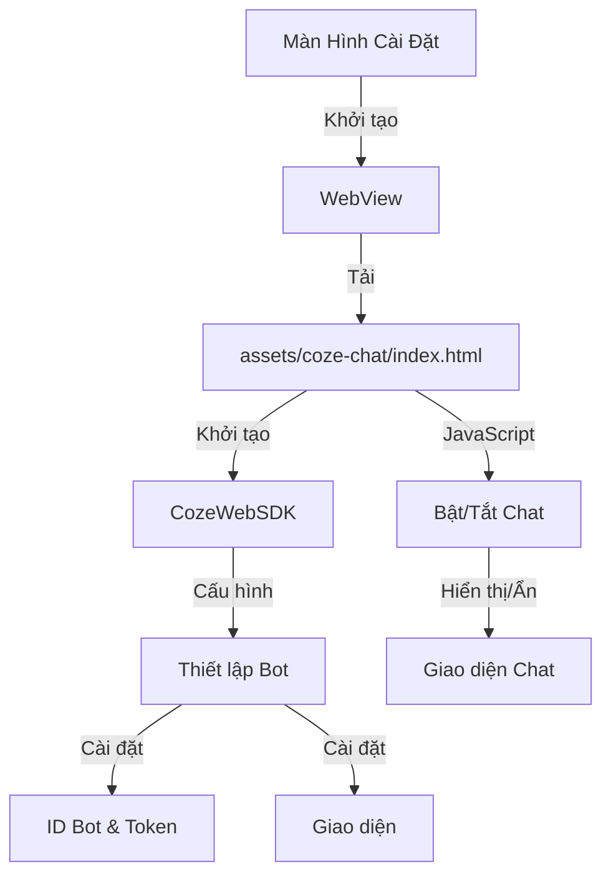

# Hệ Thống Trợ Lý Ảo Coze trong Danaloca

## Sơ Đồ Luồng Xử Lý



## 1. Cấu Trúc Thư Mục

### Thư mục coze-chat:

```
app/src/main/assets/coze-chat/
├── index.html         # Giao diện và cấu hình chat
└── README.md         # Tài liệu hướng dẫn
```

### Giao Diện HTML:

```html
<!DOCTYPE html>
<html lang="vi">
  <head>
    <meta charset="UTF-8" />
    <meta
      name="viewport"
      content="width=device-width, initial-scale=1.0, maximum-scale=1.0, user-scalable=no"
    />
    <title>Trợ Lý Ảo Coze</title>
    <!-- Styles và Bootstrap Icons -->
  </head>
  <body>
    <button id="custom-chat-button" onclick="toggleChat()">
      <i class="bi bi-chat-dots-fill"></i>
    </button>
    <!-- Script CozeWebSDK -->
  </body>
</html>
```

## 2. Thiết Lập Coze WebSDK

### Khởi Tạo SDK:

```javascript
const cozeWebSDK = new CozeWebSDK.WebChatClient({
  config: {
    botId: "7486457067655086081",
    isIframe: false,
  },
  auth: {
    type: "token",
    token:
      "pat_PGU51l4YUnQWn6XCJS2NGMbiZF2AslbMp5TWFWR2IgM0absyW6yLInNlXLm03LAQ",
    onRefreshToken: async () =>
      "pat_PGU51l4YUnQWn6XCJS2NGMbiZF2AslbMp5TWFWR2IgM0absyW6yLInNlXLm03LAQ",
  },
  userInfo: { id: "user123" },
  ui: {
    base: {
      layout: "mobile",
      zIndex: 1000,
    },
    asstBtn: { isNeed: false },
    footer: { isShow: false },
  },
});
```

### Hàm Bật/Tắt Chat:

```javascript
let isChatVisible = false;
function toggleChat() {
  if (isChatVisible) {
    cozeWebSDK.hideChatBot();
  } else {
    cozeWebSDK.showChatBot();
  }
  isChatVisible = !isChatVisible;
}
```

## 3. Giao Diện và Style

### Style Cho Khung Chat:

```css
#coze-chat-container {
  width: 100%;
  height: 100%;
  position: fixed;
  top: 0;
  left: 0;
  z-index: 1000;
  background: white;
}
```

### Style Cho Nút Chat:

```css
#custom-chat-button {
  position: fixed;
  bottom: 20px;
  right: 20px;
  width: 50px;
  height: 50px;
  border-radius: 50%;
  background-color: #28a745;
  border: none;
  color: white;
  font-size: 20px;
  display: flex;
  align-items: center;
  justify-content: center;
  z-index: 1000;
}
```

## 4. Cài Đặt WebView Trong Android

### Tải File Local:

```kotlin
webView.loadUrl("file:///android_asset/coze-chat/index.html")
```

### Bật JavaScript:

```kotlin
webView.settings.apply {
    javaScriptEnabled = true
    domStorageEnabled = true
    allowFileAccess = true
}
```

## 5. Cấu Hình Trợ Lý Ảo

### Thiết Lập Bot:

- ID Bot: 7486457067655086081
- Xác thực: Dùng Token
- Giao diện: Tối ưu cho di động
- Tùy chỉnh: Nút chat riêng

### Bảo Mật:

- Xác thực bằng Token
- Kết nối HTTPS an toàn
- Hạn chế truy cập file
- Kiểm tra domain

## 6. Thiết Kế Giao Diện

### Tối Ưu Cho Di Động:

- Giao diện responsive
- Không cho phép zoom
- Vị trí cố định
- Nút chat tùy chỉnh

### Yếu Tố Trực Quan:

- Icon từ Bootstrap
- Nút chat màu xanh lá
- Nền trắng
- Giao diện đơn giản

## 7. Chức Năng JavaScript

### Phương Thức SDK:

- Hiển thị chat
- Ẩn chat
- Cập nhật thông tin người dùng
- Làm mới token

### Xử Lý Sự Kiện:

- Sự kiện click
- Bật/tắt hiển thị
- Quản lý trạng thái
- Xử lý lỗi

## 8. Tối Ưu Hiệu Năng

### Tải Tài Nguyên:

- Sử dụng CDN cho Bootstrap Icons
- Phiên bản SDK tối giản
- Tải script bất đồng bộ
- Quản lý bộ nhớ đệm

### Quản Lý Bộ Nhớ:

- Xử lý trạng thái gọn gàng
- Dọn dẹp sự kiện
- Giải phóng tài nguyên
- Xóa bộ nhớ đệm

## 9. Tối Ưu Cho Di Động

### Cài Đặt Viewport:

```html
<meta
  name="viewport"
  content="width=device-width, initial-scale=1.0, maximum-scale=1.0, user-scalable=no"
/>
```

### Yếu Tố Giao Diện:

- Dễ dàng thao tác
- Vùng chạm lớn
- Hiển thị rõ ràng
- Chuyển động mượt mà

## 10. Triển Khai Bảo Mật

### Quản Lý Token:

```javascript
auth: {
    type: 'token',
    token: 'pat_xxx',
    onRefreshToken: async () => 'pat_xxx'
}
```

### Kiểm Soát Truy Cập:

- Lưu trữ token an toàn
- Cơ chế làm mới token
- Hạn chế truy cập file
- Kiểm tra domain

## 11. Xử Lý Lỗi

### Lỗi Mạng:

- Theo dõi kết nối
- Cơ chế thử lại
- Nội dung dự phòng
- Thông báo người dùng

### Lỗi SDK:

- Ghi log lỗi
- Khôi phục trạng thái
- Phản hồi người dùng
- Giảm thiểu tác động

## 12. Hướng Dẫn Kiểm Thử

### Kiểm Tra WebView:

- Chạy JavaScript
- Xác thực token
- Hiển thị giao diện
- Xử lý sự kiện

### Kiểm Tra Bot:

- Độ chính xác phản hồi
- Xử lý ngữ cảnh
- Khắc phục lỗi
- Đo hiệu năng
