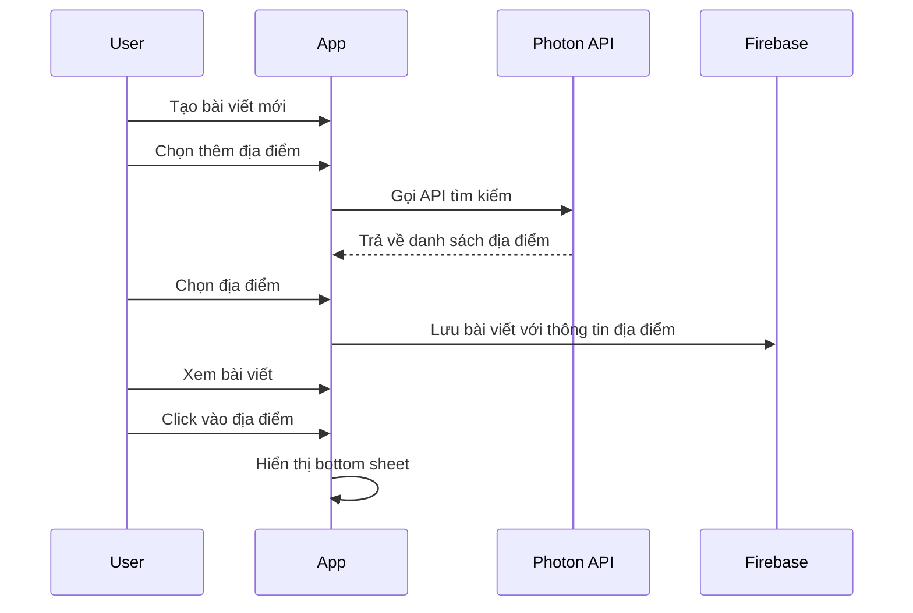

# Thêm tính năng địa điểm cho bài viết

## Tổng quan
Thêm tính năng cho phép người dùng:
- Thêm địa điểm chính xác khi tạo bài viết
- Hiển thị địa điểm đăng bài trong bài viết
- Xem chi tiết địa điểm khi nhấn vào bài viết

## API được sử dụng
- **Photon API** (https://photon.komoot.io/)
  - API miễn phí, không cần đăng ký
  - Hỗ trợ tìm kiếm địa điểm
  - Dữ liệu từ OpenStreetMap
  - Endpoint: `https://photon.komoot.io/api/`

## Các bước thực hiện

### 1. Cập nhật Model

```kotlin
// Thêm vào Post.kt
data class Post(
    // ... các trường hiện tại
    val latitude: Double = 0.0,
    val longitude: Double = 0.0, 
    val locationName: String = "",
    val address: String = ""
)

// Tạo model cho response từ Photon API
data class PhotonLocation(
    val name: String,
    val address: String,
    val lat: Double,
    val lon: Double
)
```

### 2. Tạo LocationRepository

```kotlin
// Tạo file LocationRepository.kt
class LocationRepository {
    private val photonBaseUrl = "https://photon.komoot.io/api"
    
    suspend fun searchLocation(query: String): List<PhotonLocation> {
        // Implement search using Retrofit
    }
}
```

### 3. Cập nhật UI

#### a. Layout cho tìm kiếm địa điểm
```xml
<!-- layout/location_search_dialog.xml -->
<LinearLayout>
    <EditText
        android:id="@+id/searchInput"
        android:hint="Nhập địa điểm..." />
        
    <androidx.recyclerview.widget.RecyclerView
        android:id="@+id/locationResults"
        ... />
</LinearLayout>
```

#### b. Layout hiển thị địa điểm trong bài viết
```xml
<!-- Thêm vào layout item_post.xml -->
<TextView
    android:id="@+id/locationText"
    android:drawableStart="@drawable/ic_location"
    ... />
```

#### c. Layout xem chi tiết địa điểm
```xml
<!-- layout/location_detail_bottom_sheet.xml -->
<LinearLayout>
    <TextView 
        android:id="@+id/locationName"
        ... />
    <TextView
        android:id="@+id/address"
        ... />
    <!-- Thêm MapView nếu cần -->
</LinearLayout>
```

### 4. Flow thực hiện



## Chi tiết các bước

### 1. Cài đặt dependencies
```groovy
// app/build.gradle
dependencies {
    // Retrofit cho API calls
    implementation 'com.squareup.retrofit2:retrofit:2.9.0'
    implementation 'com.squareup.retrofit2:converter-gson:2.9.0'
}
```

### 2. Triển khai LocationRepository
```kotlin
interface PhotonApi {
    @GET("/api")
    suspend fun searchLocation(
        @Query("q") query: String,
        @Query("limit") limit: Int = 10
    ): PhotonResponse
}

class LocationRepository {
    private val retrofit = Retrofit.Builder()
        .baseUrl("https://photon.komoot.io")
        .addConverterFactory(GsonConverterFactory.create())
        .build()
        
    private val api = retrofit.create(PhotonApi::class.java)
    
    suspend fun searchLocation(query: String) = 
        api.searchLocation(query)
}
```

### 3. Tạo ViewModel
```kotlin
class LocationViewModel : ViewModel() {
    private val repository = LocationRepository()
    private val _locations = MutableLiveData<List<PhotonLocation>>()
    val locations: LiveData<List<PhotonLocation>> = _locations
    
    fun searchLocation(query: String) {
        viewModelScope.launch {
            val results = repository.searchLocation(query)
            _locations.value = results
        }
    }
}
```

### 4. Cập nhật PostRepository
```kotlin
// Thêm vào PostRepository
fun createPostWithLocation(
    post: Post,
    location: PhotonLocation
): MutableLiveData<Resource<Boolean>> {
    val postWithLocation = post.copy(
        latitude = location.lat,
        longitude = location.lon,
        locationName = location.name,
        address = location.address
    )
    return createPost(postWithLocation)
}
```

## Testing

1. Unit Tests
```kotlin
@Test
fun `test location search`() {
    // Test LocationRepository
}

@Test
fun `test post creation with location`() {
    // Test PostRepository
}
```

2. UI Tests
- Kiểm tra flow thêm địa điểm khi tạo bài viết
- Kiểm tra hiển thị địa điểm trong danh sách bài viết
- Kiểm tra bottom sheet hiển thị thông tin địa điểm

## Lưu ý

1. Xử lý lỗi
- Kiểm tra kết nối mạng trước khi gọi API
- Hiển thị thông báo lỗi phù hợp
- Cache kết quả tìm kiếm gần đây

2. UX
- Thêm loading indicator khi tìm kiếm
- Debounce input tìm kiếm
- Hiển thị placeholder khi không có địa điểm

## Kế hoạch triển khai

1. Phase 1 (1-2 ngày)
- Cập nhật models
- Thêm dependencies
- Implement LocationRepository

2. Phase 2 (2-3 ngày)
- Tạo UI components
- Implement ViewModels
- Tích hợp vào flow tạo bài viết

3. Phase 3 (1-2 ngày)
- Testing
- Bug fixing
- Polish UI/UX