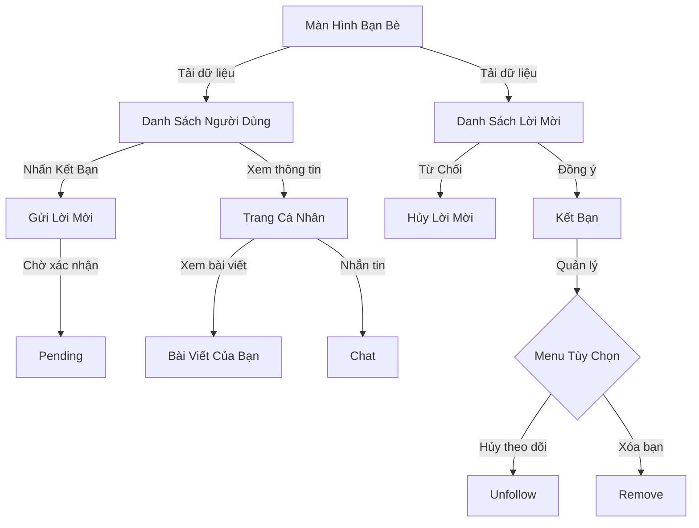

# Hệ Thống Quản Lý Bạn Bè trong Danaloca

## Sơ Đồ Luồng Xử Lý



## 1. Quản Lý Trạng Thái Kết Bạn

### Cấu trúc Friend Request

```kotlin
data class FriendRequest(
    val id: String = "",
    val senderId: String = "",
    val receiverId: String = "",
    val status: FriendRequestStatus = FriendRequestStatus.PENDING
)

enum class FriendRequestStatus {
    PENDING,   // Đã gửi, chờ xác nhận
    RECEIVED,  // Đã nhận, chưa phản hồi
    ACCEPTED,  // Đã chấp nhận
    DECLINED,  // Đã từ chối
    CANCELED   // Đã hủy lời mời
}
```

### Xử lý trong Database

1. Friend Requests:

```kotlin
friendRequestsRef.child(requestId).setValue(FriendRequest(
    id = "${senderId}_${receiverId}",
    senderId = senderId,
    receiverId = receiverId,
    status = FriendRequestStatus.PENDING
))
```

2. Users (sau khi chấp nhận):

```kotlin
val updates = hashMapOf<String, Any?>(
    "/users/${request.senderId}/friends/${request.receiverId}" to true,
    "/users/${request.receiverId}/friends/${request.senderId}" to true,
    "/friend_requests/${request.id}/status" to FriendRequestStatus.ACCEPTED
)
```

## 2. Giao Diện Tương Tác (FriendActionsView)

### Trạng thái nút:

1. Add Friend (Thêm bạn)
2. Cancel Request (Hủy lời mời)
3. Accept/Decline (Đồng ý/Từ chối)
4. Friend Options (Menu tùy chọn khi đã là bạn)

### Cập nhật trạng thái:

```kotlin
fun updateState(user: User?, requests: List<FriendRequest>?) {
    when {
        user?.isFriendWith(currentUserId) == true -> {
            showFriendsOptions()
        }
        sentRequest?.status == FriendRequestStatus.PENDING -> {
            showCancelRequest()
        }
        receivedRequest?.status == FriendRequestStatus.PENDING -> {
            showReceivedRequest()
        }
        else -> {
            showAddFriend()
        }
    }
}
```

## 3. Trang Cá Nhân (UserProfileFragment)

### Thông tin hiển thị:

- Ảnh đại diện
- Tên người dùng
- Thông tin cơ bản (giới tính, tuổi, vị trí)
- Trạng thái bạn bè
- Danh sách bài viết cá nhân

### Chức năng:

1. Quản lý kết bạn
2. Nhắn tin
3. Xem bài viết
4. Menu tùy chọn bạn bè

### Code mẫu:

```kotlin
private fun setupFriendActions() {
    friendActions.apply {
        setUserIds(currentId, profileId)
        setAddFriendListener { friendsViewModel.sendFriendRequest(currentId, it) }
        setCancelRequestListener { requestId ->
            friendsViewModel.cancelFriendRequest(requestId, profileId)
        }
        setAcceptRequestListener { request ->
            friendsViewModel.acceptFriendRequest(request)
        }
    }
}
```

## 4. Quản Lý Dữ Liệu (FriendsRepository)

### Cấu trúc dữ liệu Firebase:

```
/friend_requests/
    /{requestId}/
        senderId: String
        receiverId: String
        status: FriendRequestStatus

/users/
    /{userId}/
        friends: Map<String, Boolean>
```

### Các chức năng chính:

1. Lấy danh sách lời mời:

```kotlin
fun getFriendRequests(userId: String) {
    // Lấy cả lời mời đã gửi và nhận
    val allRequests = mutableMapOf<String, FriendRequest>()

    // Lời mời nhận được
    friendRequestsRef
        .orderByChild("receiverId")
        .equalTo(userId)
        .addValueEventListener(...)

    // Lời mời đã gửi
    friendRequestsRef
        .orderByChild("senderId")
        .equalTo(userId)
        .addValueEventListener(...)
}
```

2. Xử lý kết bạn:

```kotlin
fun acceptFriendRequest(request: FriendRequest) {
    val updates = hashMapOf<String, Any?>(
        "/users/${request.senderId}/friends/${request.receiverId}" to true,
        "/users/${request.receiverId}/friends/${request.senderId}" to true,
        "/friend_requests/${request.id}/status" to FriendRequestStatus.ACCEPTED
    )
    database.reference.updateChildren(updates)
}
```

3. Xóa bạn:

```kotlin
fun removeFriend(userId: String, friendId: String) {
    val updates = hashMapOf<String, Any?>(
        "/users/$userId/friends/$friendId" to null,
        "/users/$friendId/friends/$userId" to null
    )
    database.reference.updateChildren(updates)
}
```

## 5. Hiển Thị Danh Sách (FriendsAdapter)

### Item bạn bè:

- Avatar
- Tên người dùng
- Vị trí (nếu có)
- Nút tương tác (thêm bạn/hủy/xác nhận)

### Xử lý tương tác:

1. Click vào item: Mở trang cá nhân
2. Click nút tương tác: Xử lý trạng thái kết bạn
3. Long press: Hiển thị menu tùy chọn (với bạn bè)

## 6. Logic Xử Lý (FriendsViewModel)

### Quản lý state:

```kotlin
private val _users = MutableLiveData<Resource<List<User>>>()
private val _friendRequests = MutableLiveData<Resource<List<FriendRequest>>>()
private val _operationState = MutableLiveData<Resource<Unit>?>()
```

### Các operation chính:

1. Load users và friend requests
2. Gửi/hủy lời mời kết bạn
3. Chấp nhận/từ chối lời mời
4. Xóa bạn/hủy theo dõi

### Auto reload:

- Reload friend requests sau mỗi thao tác
- Reload users sau khi chấp nhận/từ chối
- Reset operation state sau mỗi thao tác

## 7. Tối Ưu Hiệu Năng

### Cache Avatar và Username:

```kotlin
private val userNameCache = mutableMapOf<String, String>()
private val userAvatarCache = mutableMapOf<String, String>()
```

### Lazy Loading:

- Load avatar khi item hiển thị
- Cache bitmap trong memory
- Placeholder cho avatar đang load

### Firebase Indexing:

- Index theo receiverId
- Index theo senderId
- Index theo status

## 8. Xử Lý Lỗi

### Network Errors:

- Retry mechanism cho các operation
- Cache dữ liệu offline
- Hiển thị thông báo lỗi

### Consistency:

- Validate trạng thái trước khi thay đổi
- Transaction cho các update phức tạp
- Cleanup data không hợp lệ

### User Experience:

- Loading state cho mỗi operation
- Error message dễ hiểu
- Confirmation dialog cho các thao tác quan trọng
