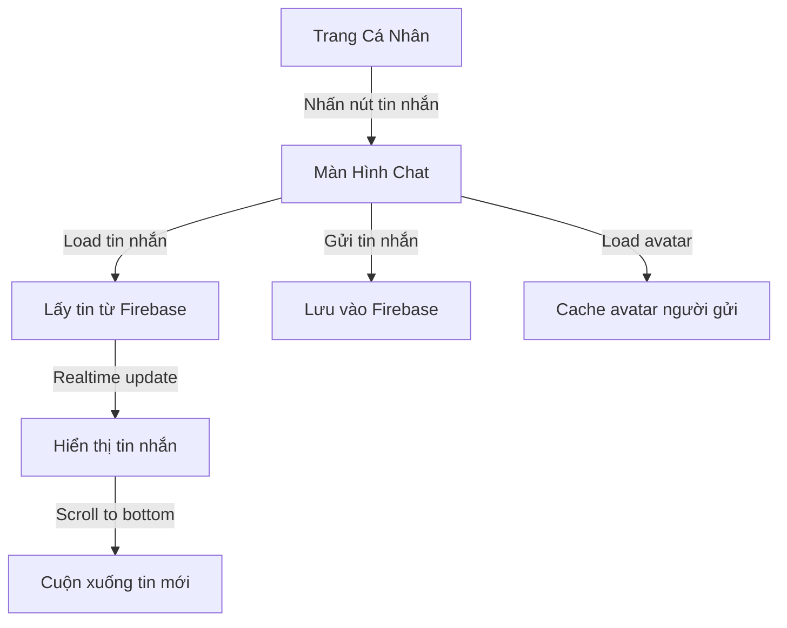

# Hệ Thống Nhắn Tin trong Danaloca

## Sơ Đồ Luồng Xử Lý



## 1. Cấu Trúc Tin Nhắn

### ChatMessage Model

```kotlin
data class ChatMessage(
    val id: String = "",
    val senderId: String = "",
    val receiverId: String = "",
    val message: String = "",
    val timestamp: Long = System.currentTimeMillis()
)
```

### Cấu trúc Database Firebase

```
/messages/
    /{messageId}/
        id: String
        senderId: String
        receiverId: String
        message: String
        timestamp: Long
```

## 2. Giao Diện Chat (ChatFragment)

### Thành phần giao diện:

1. Header:
   - Nút back
   - Avatar người nhận
   - Tên người nhận
2. Danh sách tin nhắn:
   - RecyclerView với LinearLayoutManager
   - Stack from end (tin mới ở dưới)
3. Input section:
   - EditText nhập tin nhắn
   - Nút gửi

### Khởi tạo và setup:

```kotlin
private fun setupUI() {
    setupRecyclerView()
    setupMessageInput()
    setupBackButton()
}

private fun setupRecyclerView() {
    chatAdapter = ChatAdapter()
    binding.messagesRecyclerView.apply {
        layoutManager = LinearLayoutManager(context).apply {
            stackFromEnd = true
        }
        adapter = chatAdapter
    }
}
```

## 3. Hiển Thị Tin Nhắn (ChatAdapter)

### Layout tin nhắn:

- Tin nhắn gửi:
  - Căn phải
  - Background màu primary
  - Hiển thị thời gian
- Tin nhắn nhận:
  - Căn trái
  - Avatar người gửi
  - Background màu khác
  - Hiển thị thời gian

### Xử lý hiển thị:

```kotlin
fun bind(message: ChatMessage) {
    if (message.senderId == currentUserId) {
        // Hiển thị tin nhắn gửi
        binding.sentMessageLayout.visibility = View.VISIBLE
        binding.receivedMessageLayout.visibility = View.GONE
        binding.sentMessageText.text = message.message
        binding.sentTime.text = formatTime(message.timestamp)
    } else {
        // Hiển thị tin nhắn nhận
        binding.sentMessageLayout.visibility = View.GONE
        binding.receivedMessageLayout.visibility = View.VISIBLE
        binding.receivedMessageText.text = message.message
        binding.receivedTime.text = formatTime(message.timestamp)
        loadSenderAvatar(message.senderId)
    }
}
```

### Cache Avatar:

```kotlin
private fun loadSenderAvatar(senderId: String) {
    GlobalScope.launch(Dispatchers.Main) {
        val avatarUrl = userViewModel.GetUserAvatar(senderId)
        GlideUtils.loadProfileImage(
            binding.senderAvatar,
            avatarUrl
        )
    }
}
```

## 4. Quản Lý Tin Nhắn (ChatRepository)

### Gửi tin nhắn:

```kotlin
fun sendMessage(receiverId: String, message: String): MutableLiveData<Resource<String>> {
    // 1. Tạo message ID
    val messageId = messagesRef.push().key

    // 2. Tạo đối tượng tin nhắn
    val chatMessage = ChatMessage(
        id = messageId,
        senderId = currentUserId,
        receiverId = receiverId,
        message = message
    )

    // 3. Lưu vào Firebase
    messagesRef.child(messageId).setValue(chatMessage)
}
```

### Lấy danh sách tin nhắn:

```kotlin
fun getMessages(otherUserId: String): MutableLiveData<Resource<List<ChatMessage>>> {
    messagesRef.addValueEventListener(object : ValueEventListener {
        override fun onDataChange(snapshot: DataSnapshot) {
            val messages = mutableListOf<ChatMessage>()
            for (messageSnapshot in snapshot.children) {
                val message = messageSnapshot.getValue(ChatMessage::class.java)
                message?.let {
                    if ((it.senderId == currentUserId &&
                         it.receiverId == otherUserId) ||
                        (it.senderId == otherUserId &&
                         it.receiverId == currentUserId)
                    ) {
                        messages.add(it)
                    }
                }
            }
            messages.sortBy { it.timestamp }
        }
    })
}
```

## 5. Logic Xử Lý (ChatViewModel)

### Quản lý state:

```kotlin
private var _messages: MutableLiveData<Resource<List<ChatMessage>>>? = null
private var _sendMessageStatus = MutableLiveData<Resource<String>>()
```

### Các operation chính:

1. Load tin nhắn:

```kotlin
fun loadMessages(otherUserId: String) {
    if (_messages == null) {
        _messages = repository.getMessages(otherUserId)
    }
}
```

2. Gửi tin nhắn:

```kotlin
fun sendMessage(receiverId: String, message: String) {
    _sendMessageStatus = repository.sendMessage(receiverId, message)
}
```

## 6. Tối Ưu Hiệu Năng

### Lazy Loading Avatar

- Chỉ load avatar cho tin nhắn nhận
- Cache avatar đã load
- Sử dụng Glide để quản lý memory

### RecyclerView Optimization

- View recycling cho tin nhắn
- Layout inflating tối ưu
- Scroll position tự động

### Firebase Realtime Database

- Realtime updates cho tin nhắn mới
- Lọc tin nhắn theo người gửi/nhận
- Sắp xếp theo thời gian

## 7. Xử Lý Lỗi

### Network Errors:

- Kiểm tra kết nối trước khi gửi
- Retry mechanism cho tin nhắn lỗi
- Hiển thị trạng thái gửi/lỗi

### Authentication Errors:

- Kiểm tra đăng nhập
- Xử lý token hết hạn
- Redirect to login nếu cần

### Data Consistency:

- Validate tin nhắn trước khi gửi
- Xử lý duplicate messages
- Cleanup cho tin nhắn lỗi

## 8. Trải Nghiệm Người Dùng

### Loading States:

- Progress indicator khi load tin nhắn
- Disable input khi đang gửi
- Scroll indicator cho tin mới

### Visual Feedback:

- Animation khi gửi/nhận tin nhắn
- Hiển thị thời gian theo định dạng thân thiện
- Avatar placeholder khi đang load

### Error Handling:

- Toast messages cho lỗi
- Retry options cho tin nhắn lỗi
- Clear input sau khi gửi thành công
