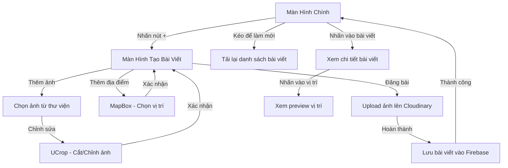

# Hệ Thống Bài Viết trong Danaloca

## Sơ Đồ Luồng Xử Lý Tổng Quan



## 1. Màn Hình Chính (HomeFragment)

### Giao diện Bài Viết

- Card view với góc bo tròn 30dp
- Nền màu #DEEDFA
- Bố cục từ trên xuống:
  1. Ảnh bài viết (tỷ lệ 4:3, bo góc)
  2. Thông tin người đăng:
     - Avatar tròn với viền trắng 2dp
     - Tên người dùng (in đậm)
     - Icon vị trí và thời gian đăng
  3. Nút tương tác:
     - Like (với số lượt thích)
     - Comment (với số bình luận)
     - Bookmark
  4. Nội dung bài viết
  5. Preview người thích (hiển thị 2 avatar đầu tiên)

### Chức năng chính:

- Pull-to-refresh load bài viết mới
- Cache thông tin người dùng:
  ```kotlin
  private val userNameCache = mutableMapOf<String, String>()
  private val userAvatarCache = mutableMapOf<String, String>()
  ```
- Hiển thị thời gian thông minh:
  ```kotlin
  when {
      diff < 60_000 -> "Just now"
      diff < 3600_000 -> "${diff / 60_000} minutes ago"
      diff < 86400_000 -> "${diff / 3600_000} hours ago"
      // ...
  }
  ```

## 2. Tạo Bài Viết (CreatePostActivity)

### Giao diện

- AppBar với:
  - Nút back
  - Tiêu đề "Create Post"
  - Nút đăng bài
- Card view chứa:
  - EditText cho nội dung
  - Nút thêm vị trí
  - Nút thêm ảnh
  - Preview ảnh (nếu có)
  - Preview vị trí (nếu có)

### Quy trình xử lý ảnh

1. Yêu cầu quyền:

```kotlin
when {
    checkSelfPermission(READ_EXTERNAL_STORAGE) == PERMISSION_GRANTED -> {
        pickImage.launch("image/*")
    }
    else -> {
        requestPermission.launch(READ_EXTERNAL_STORAGE)
    }
}
```

2. Cắt và điều chỉnh ảnh với UCrop:

```kotlin
UCrop.of(sourceUri, destinationUri)
    .withOptions(options.apply {
        setCompressionQuality(85)
        setHideBottomControls(false)
        setFreeStyleCropEnabled(false)
        setAspectRatio(1f, 1f)
        setMaxResultSize(1080, 1080)
    })
```

### Chọn vị trí trên bản đồ

1. MapLocationActivity:

   - MapBox với style Streets
   - Nút zoom in/out
   - Nút xóa marker
   - Marker điều chỉnh được
   - Hiển thị mặc định tại Đà Nẵng:

   ```kotlin
   Point.fromLngLat(108.2022, 16.0544)
   ```

2. Xem preview vị trí:
   - Dialog hiển thị map
   - Marker cố định
   - Nút zoom in/out
   - Animation slide-in từ bottom

## 3. Chi Tiết Bài Viết (PostDetailFragment)

### Giao diện

- Toolbar với tên người đăng
- Thông tin chi tiết:
  - Avatar và tên người dùng
  - Thời gian đăng đầy đủ
  - Ảnh bài viết full-size
  - Vị trí (nếu có)
  - Số lượt thích và bình luận
  - Nút tương tác

### Chức năng

- Xem ảnh full-size
- Nhấn vào vị trí để mở preview map
- Like/unlike realtime
- Hiển thị thời gian chi tiết:

```kotlin
SimpleDateFormat("MMMM d, yyyy 'at' HH:mm", Locale.getDefault())
```

## 4. Xử Lý Dữ Liệu

### Cấu trúc Post trong Firebase

```kotlin
data class Post(
    val id: String = "",
    val userId: String = "",
    val content: String = "",
    val imageUrl: String = "", // URL Cloudinary
    val timestamp: Long = System.currentTimeMillis(),
    val likes: Int = 0,
    val comments: Int = 0,
    val latitude: Double? = null,
    val longitude: Double? = null,
    val likedUsers: MutableMap<String, Boolean> = mutableMapOf()
)
```

### Quản lý bài viết (PostRepository)

1. Tạo bài viết:

```kotlin
fun createPostWithImage(post: Post, bitmap: Bitmap): LiveData<Resource<Boolean>> {
    // 1. Upload ảnh lên Cloudinary
    val imageUrl = ImageUtils.uploadImage(context, bitmap, "posts")

    // 2. Tạo post với URL ảnh
    val postWithImage = post.copy(imageUrl = imageUrl)

    // 3. Lưu vào Firebase
    return postsRef.child(post.id).setValue(postWithImage)
}
```

2. Load danh sách bài viết:

```kotlin
postsRef.addValueEventListener(object : ValueEventListener {
    override fun onDataChange(snapshot: DataSnapshot) {
        val posts = mutableListOf<Post>()
        for (postSnapshot in snapshot.children) {
            postSnapshot.getValue(Post::class.java)?.let { post ->
                posts.add(post)
            }
        }
        posts.sortByDescending { it.timestamp }
        result.value = Resource.success(posts)
    }
})
```

3. Xử lý like:

```kotlin
fun toggleLike(postId: String, userId: String) {
    val postRef = postsRef.child(postId)
    postRef.get().addOnSuccessListener { snapshot ->
        val post = snapshot.getValue(Post::class.java)
        if (post != null) {
            val likedUsers = post.likedUsers.toMutableMap()
            val isLiked = likedUsers.containsKey(userId)

            if (isLiked) {
                // Unlike
                likedUsers.remove(userId)
                postRef.updateChildren(mapOf(
                    "likes" to post.likes - 1,
                    "likedUsers" to likedUsers
                ))
            } else {
                // Like
                likedUsers[userId] = true
                postRef.updateChildren(mapOf(
                    "likes" to post.likes + 1,
                    "likedUsers" to likedUsers
                ))
            }
        }
    }
}
```

## 5. Xử Lý Ảnh

### Upload lên Cloudinary

1. Nén và resize:
   - Giới hạn kích thước 1080x1080
   - Chất lượng nén 85%
   - Format JPEG
2. Tổ chức thư mục:
   - Folder "posts" cho ảnh bài viết
   - Mỗi ảnh có ID unique
   - URL format: cloudinary://{cloud_name}/image/upload/v{version}/{post_id}

### Cache và Loading

- Sử dụng Glide để load và cache ảnh
- Placeholder mặc định khi đang load
- Error image khi load thất bại
- Cache memory và disk
- Transform hình tròn cho avatar

## 6. Tối Ưu Hiệu Năng

### Cache dữ liệu người dùng

```kotlin
private val userNameCache = mutableMapOf<String, String>()
private val userAvatarCache = mutableMapOf<String, String>()

private fun loadUserDetails(post: Post) {
    val cachedName = userNameCache[post.userId]
    if (cachedName != null) {
        userName.text = cachedName
    } else {
        lifecycleScope.launch {
            val fullName = userViewModel.GetUserFullName(post.userId)
            userNameCache[post.userId] = fullName
            userName.text = fullName
        }
    }
    // Tương tự với avatar
}
```

### RecyclerView Optimization

- ViewHolder pattern
- Efficient view recycling
- Load ảnh lazy khi scroll
- Cache bitmap trong memory

### Firebase Realtime Database

- Lắng nghe thay đổi realtime
- Chỉ load dữ liệu cần thiết
- Index cho truy vấn thường xuyên
- Cache offline mode

## 7. Xử Lý Lỗi

### Network Errors

- Kiểm tra kết nối trước khi upload
- Retry mechanism cho upload ảnh
- Cache dữ liệu offline
- Thông báo lỗi người dùng

### Permission Errors

- Kiểm tra và yêu cầu quyền storage
- Fallback khi không có quyền
- Hướng dẫn cấp quyền trong settings

### Upload Errors

- Validate kích thước ảnh
- Kiểm tra định dạng file
- Retry upload tự động
- Thông báo lỗi cụ thể

### Location Errors

- Xử lý khi không có GPS
- Fallback về last known location
- Thông báo khi không thể lấy vị trí
