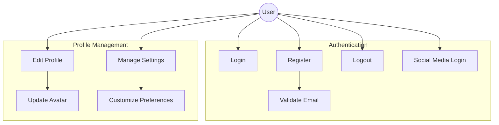
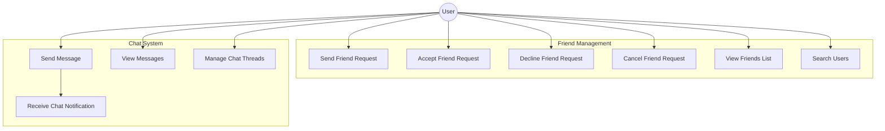
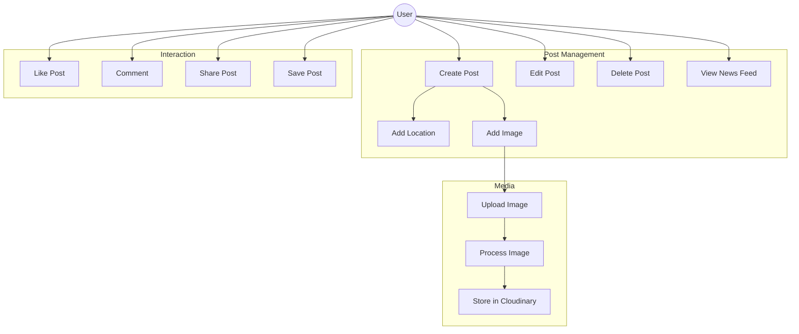
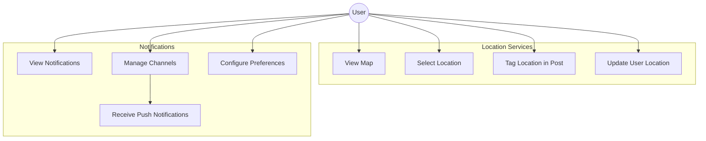
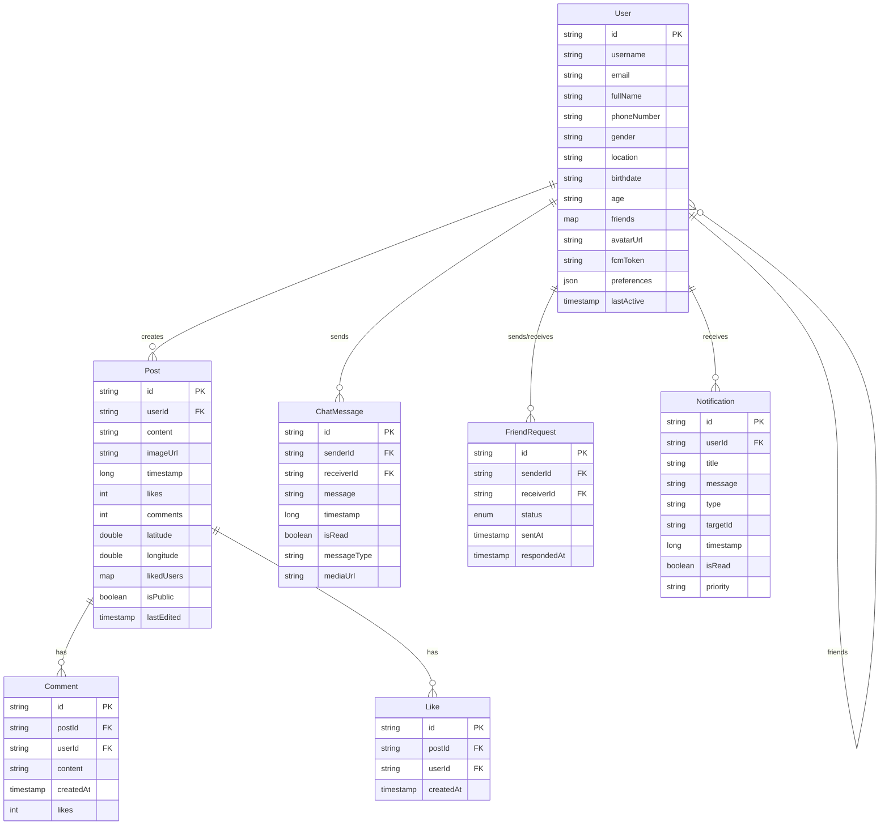

# System Documentation

## 1. Use Case Diagrams

### Authentication & Profile System

### Social Features

### Content Management

### Location & Notification System

## 2. Entity Relationship Diagram

## System Features

1. **Authentication & Security**

   - Email/Password authentication
   - Social media login integration
   - Session management
   - Token-based authentication
   - Security rules implementation

2. **Profile System**

   - Comprehensive user profiles
   - Avatar management with Cloudinary
   - Profile customization
   - Privacy settings
   - User preferences

3. **Social Networking**

   - Friend management system
   - Real-time chat
   - Post creation and interaction
   - News feed with real-time updates
   - Comment and like system

4. **Media Management**

   - Image upload and processing
   - Cloudinary integration
   - Media optimization
   - Cache management
   - Lazy loading implementation

5. **Location Services**

   - MapBox integration
   - Location tagging
   - Map visualization
   - Location-based features
   - Geolocation services

6. **Notifications**

   - Firebase Cloud Messaging
   - Multiple notification channels
   - Push notification system
   - Notification preferences
   - Real-time alerts

7. **Data Management**

   - Firebase Realtime Database
   - Offline persistence
   - Data synchronization
   - Cache strategies
   - Real-time updates

8. **UI/UX Features**
   - Material Design implementation
   - Custom animations
   - Responsive layouts
   - Interactive elements
   - Loading states with Shimmer
